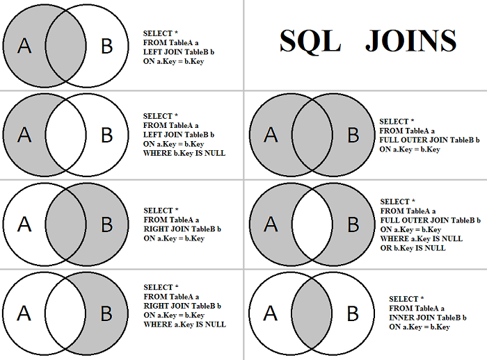

Альтернативный редактор DB Browser for SQLite via http://sqlitebrowser.org или
```text
sudo add-apt-repository -y ppa:linuxgndu/sqlitebrowser
sudo apt-get update
sudo apt-get install sqlitebrowser
``` 

### Драйвер JDBC
http://mvnrepository.com/artifact/org.xerial/sqlite-jdbc 
https://bitbucket.org/xerial/sqlite-jdbc/downloads/

### Документация
https://www.sqlite.org/docs.html 

### Синтаксис
https://www.sqlite.org/lang.html

### Все виды доступных join
http://sqlite.org/syntaxdiagrams.html#join-op


### SQLite
 - Читать БД могут несколько процессов, записывать только один.
 - Не рекомендуется расшаривать БД: проблемы с блокировкой.

### Типы данных
https://www.sqlite.org/datatype3.html: 
- INTEGER
- TEXT
- BLOB
- REAL
- NUMERIC

**INTEGER:**
            INT
            INTEGER
            TINYINT
            SMALLINT
            MEDIUMINT
            BIGINT
            UNSIGNED BIG INT
            INT2
            INT8

**TEXT:**
            CHARACTER(20)
            VARCHAR(255)
            VARYING CHARACTER(255)
            NCHAR(55)
            NATIVE CHARACTER(70)
            NVARCHAR(100)
            TEXT
            CLOB

**BLOB:**
            BLOB
            no datatype specified

**REAL:**
            REAL
            DOUBLE
            DOUBLE PRECISION
            FLOAT

**NUMERIC:**
            NUMERIC
            DECIMAL(10,5)
            BOOLEAN
            DATE
            DATETIME 